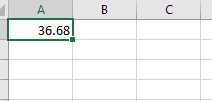
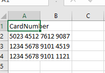
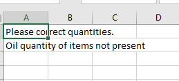
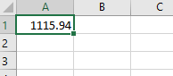

# 202 Individual Project


### How to run?

 - command to run 
 ```java -jar 202IndividualProject.jar`pathToDataset.csv pathToCards.csv pathToInput.csv outputDirPath```

Note: the jar is preset in the root director of the project

### Ouput?

 - Output for Input1
  
  
 
  


- Output for Input2

  


- Output for Input3

  
