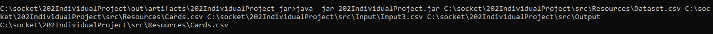
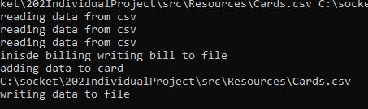
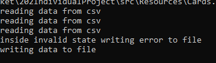
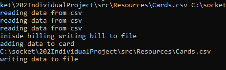
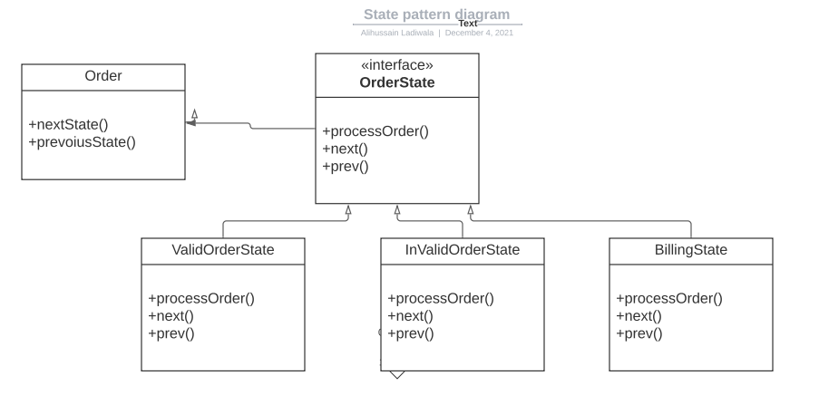
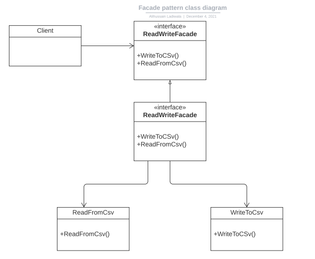

# 202 Individual Project


### How to run?

 - command to run 
 ```java -jar 202IndividualProject.jar`pathToDataset.csv pathToCards.csv pathToInput.csv outputDirPath```
 
 eg:
 
   
 
 

Note: the jar is preset in the root director of the project

### Ouput?

 - Output for Input1
   
   
  
   
   
   


- Output for Input2

  

  

- Output for Input3

  
  
  
  
### Patterns

- State Pattern

  
  
  Have used the state pattern to move between various states of the order such as billing, valid and invalid order state which gives 
  flexibilty in handling functionality such as output for each state and also gives flexibilty to add more states in the future to handle 
  more functionality in the future.

- Facade Pattern

  
  
  Have used the facade pattern to encapulate the complexity of file reading and writing from the rest of the code. Which alloows the business logic to
  be much cleaner and gives flexibilty to modify I/O in the future. 

  
  
  
  
  
  
 
  
